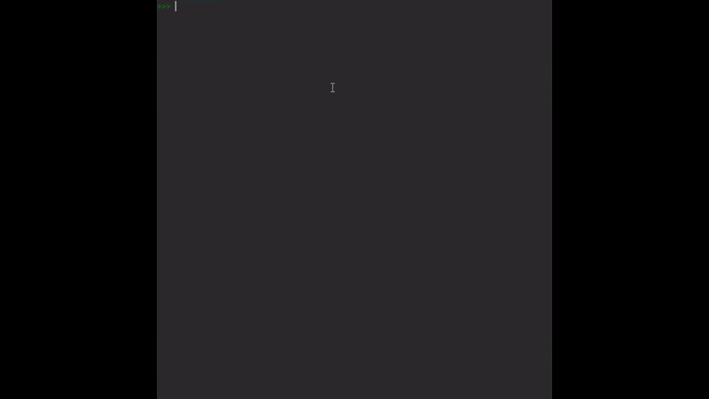

# recipe-manager
Recipe manager. Calculate ingredient quantities for custom portions. Add new recipes to the collection stored in a text file. Delete existing recipes.

### Example usage:

##### Recipe Collection stored in ```recipes.txt``` formatted with JSON, e.g. "Marmorkuchen".

- Methods of the ```Recipe``` Class:
  - ```print_recipe(target_portions)```: Print recipe for the specified portions. 
  - ```list_recipes()```: List names of recipes currently stored in collection.
  - ```print_recipe_list()```: Print every recipe in collection for the base portion.
  - ```delete()```: Delete recipe from collection.
  - ```add_new_recipe()```: Starts the process of adding a new recipe to the collection. Called automatically if the recipe of the instance is not part of the collection. 
  - ```add_ingredients()```: Add ingredients to the current recipe.
  - ```update_recipe()```: Update text file with parameters of current recipe object    
    
- Process of adding new recipe:
  ```
  Pancake = Recipe("Pancake", 5) # Create instance and follow steps
  ```
  <p align="center">
  
  </p>
  
  Use newly added recipe and calculate/print quantities for ingredients:
  
  
